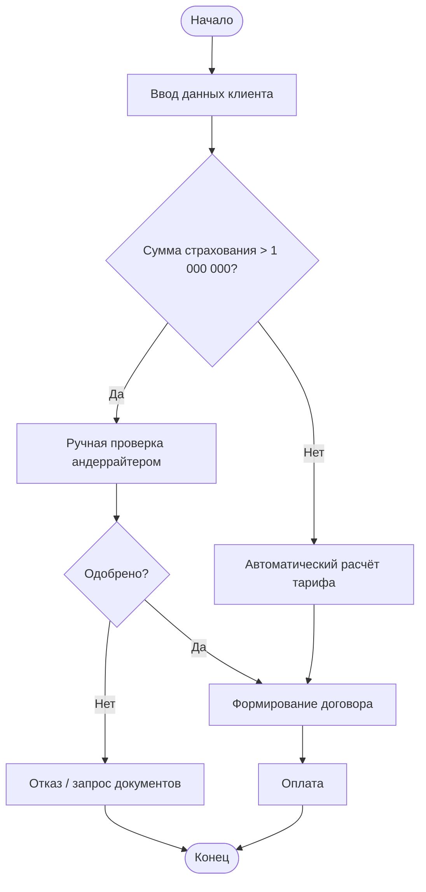

# Flowchart: Расчёт стоимости страхового полиса

```mermaid
flowchart TD
    A([Начало]) --> B[Ввод данных клиента]
    B --> C{Сумма страхования > 1 000 000?}
    C -- Да --> D[Ручная проверка андеррайтером]
    C -- Нет --> E[Автоматический расчёт тарифа]
    D --> F{Одобрено?}
    F -- Нет --> G[Отказ / запрос документов]
    F -- Да --> H[Формирование договора]
    E --> H
    H --> I[Оплата]
    I --> J([Конец])
    G --> J
```
