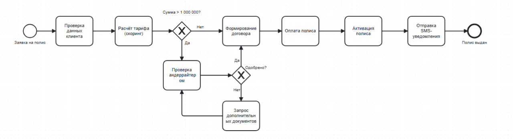
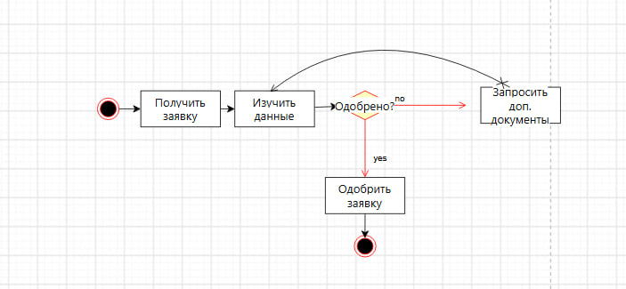
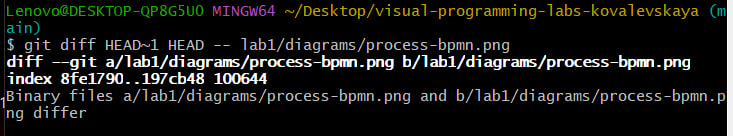
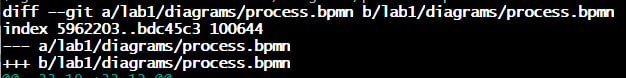

# Отчёт по лабораторной работе №1

## Краткое описание процесса

Выбран процесс «Оформление страхового полиса». Участники: клиент, агент,
система скоринга, андеррайтер, платёжная система. Процесс включает
автоматическую оценку рисков системой скоринга и ручную проверку
андеррайтером при сумме страхования свыше 1 000 000 руб. Есть ветвление
(одобрено / нужны документы) и цикл возврата при запросе документов,
а также параллельные действия при формировании договора и подготовке счёта.

## Диаграммы

- BPMN: 
- UML Activity: 
- Sequence Diagram: см. [docs/sequence.md](docs/sequence.md)
- Flowchart: см. [docs/flowchart.md](docs/flowchart.md)
- Бинарный diff (stat): 
Для `.bpmn` (текстовый XML) Git показывает построчный diff — видно,
какие именно строки добавлены или удалены. Для `.png` (бинарный файл)
Git выводит только «Binary files differ», без деталей. Это наглядно
показывает разницу между текстовыми и бинарными форматами при
версионировании.
## Демонстрация diff

Чтобы показать разницу между текстовыми и бинарными форматами при версионировании, я внесла изменение в BPMN-диаграмму: добавила задачу «Отправка SMS-уведомления» и две новые sequence flow. После этого выполнила `git diff`.

Для `.bpmn` (текстовый XML) Git показал построчный diff — видно конкретные добавленные строки XML. Для `.png` (бинарный файл) Git не может сравнить содержимое и выводит только «Binary files differ».

### Скриншоты

Бинарный diff (`.png`):

Текстовый diff (`.bpmn`):

