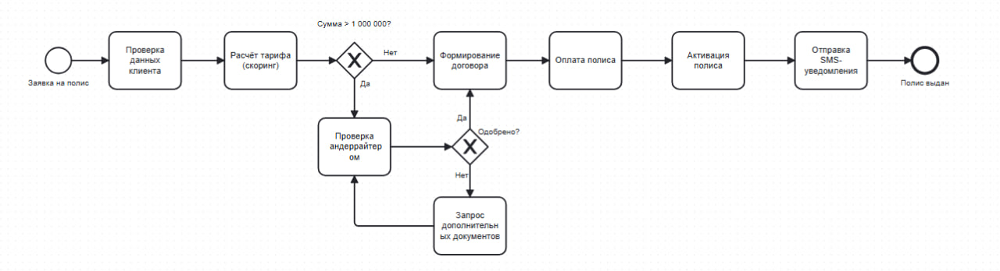
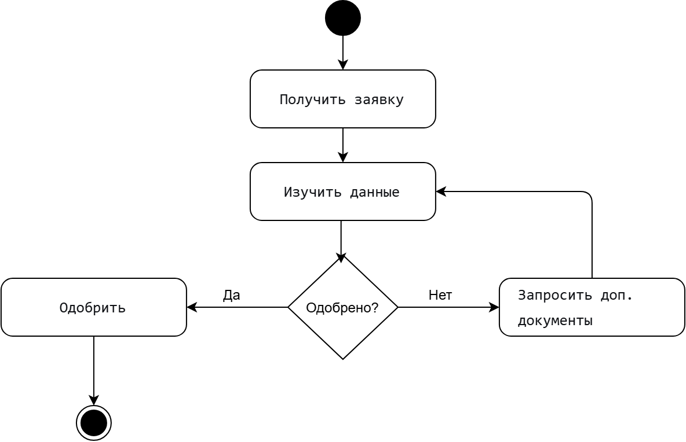
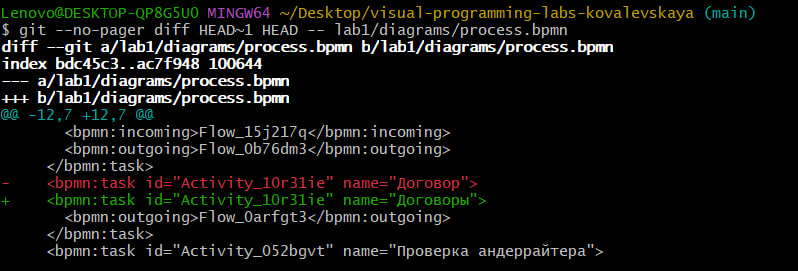
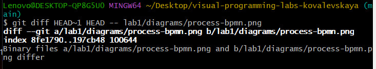

# Отчёт по лабораторной работе №1

## Краткое описание процесса

Выбран процесс «Оформление страхового полиса». Участники: клиент, агент,
система скоринга, андеррайтер, платёжная система. Процесс включает
автоматическую оценку рисков системой скоринга и ручную проверку
андеррайтером при сумме страхования свыше 1 000 000 руб. Есть ветвление
(одобрено / нужны документы) и цикл возврата при запросе документов.

## Диаграммы

- BPMN: 
- UML Activity: 
- Sequence Diagram: см. [docs/sequence.md](docs/sequence.md)
- Flowchart: см. [docs/flowchart.md](docs/flowchart.md)

## Демонстрация diff

Чтобы показать разницу между текстовыми и бинарными форматами при
версионировании, я внесла изменение в BPMN-диаграмму: переименовала
задачу «Договор» → «Договора». После этого
выполнила `git diff HEAD~1 HEAD -- lab1/diagrams/process.bpmn`.

Для `.bpmn` (текстовый XML) Git показал построчный diff — видно
конкретные добавленные (`+`) и удалённые (`-`) строки. Для `.png`
(бинарный файл) Git не может сравнить содержимое и выводит только
«Binary files differ».

### Скриншоты

Текстовый diff (`.bpmn`):

Бинарный diff (`.png`):

## Выводы

В ходе работы я настроила SSH-доступ к GitHub, освоила базовые команды
Git (clone, add, commit, push, diff, log) и научилась работать с
визуальными нотациями BPMN, UML Activity, Sequence и Flowchart.
Главный практический вывод — текстовые форматы удобны для
версионирования (видно каждое изменение), а бинарные нужно хранить
вместе с исходниками и перегенерировать при изменениях.
